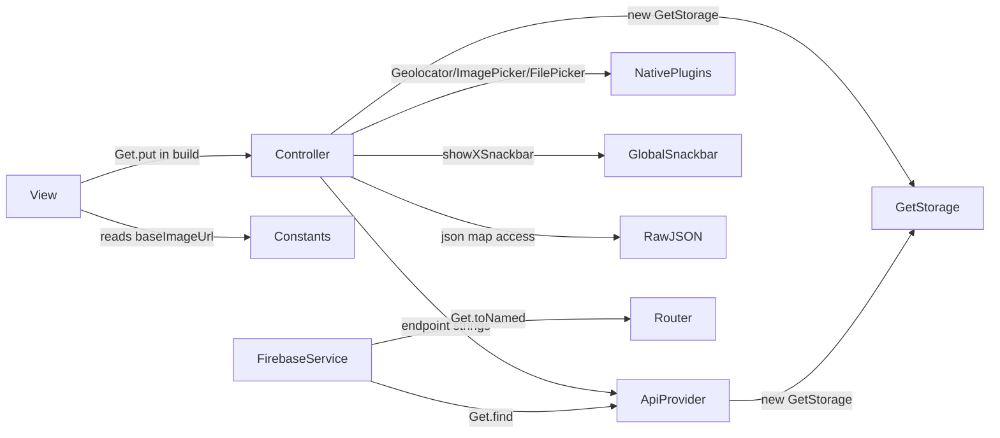
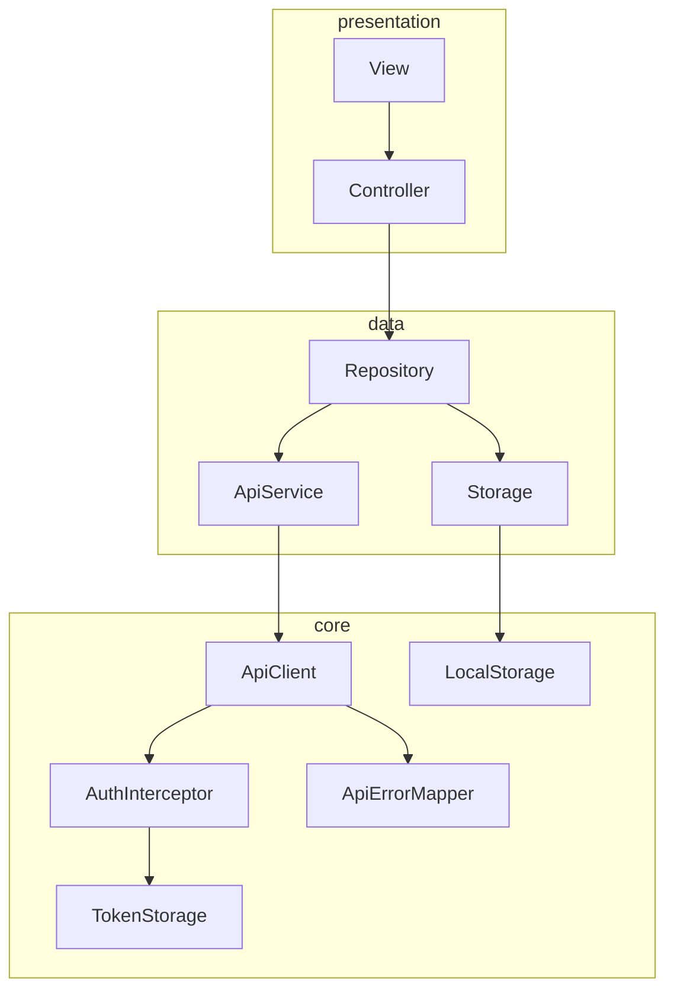

# 01 — Architecture Audit

> **Diperbarui 2026-09-01.** Temuan di bawah adalah audit aslinya terhadap commit
> `d1745fd` dan **tidak diubah** — status per temuan ada di *Addendum 2* di akhir
> berkas, dan temuan baru di sisi backend yang menggerbang client ada di
> *Addendum 3*. Ketika badan dokumen dan addendum berbeda, addendum yang berlaku.

> Findings are ordered by severity. Every finding cites a real file and line from
> commit `d1745fd`. Nothing here is speculative; where I could not prove impact I
> say so explicitly.

**Legend — Severity**

| Level | Meaning |
|---|---|
| CRITICAL | Security exposure or data-integrity failure. Act before anything else. |
| HIGH | Causes user-visible breakage, or blocks the refactor from being safe. |
| MEDIUM | Real maintainability/correctness cost, no immediate outage. |
| LOW | Consistency, hygiene, polish. |

**Legend — Regression risk** = risk of *fixing* it, not risk of leaving it.

---

# Current Architecture

ESAS is a GetX application organised **layer-first inside a module-first shell**:

```
app/modules/<feature>/{bindings,controllers,views}   ← UI + logic + networking
app/data/<Feature>/*.m.dart                          ← models, detached from features
app/services/api_*.dart                              ← two GetConnect subclasses
app/widgets/{controllers,views}                      ← misc globals
utils/                                               ← theme, helpers, TLS, Firebase, notifications
```

The dependency graph as actually built:



There are **four layers collapsed into one**. The controller is simultaneously the
view-model, the repository, the API service, the JSON mapper, the storage gateway,
the permission handler, and the error presenter.

There is no repository layer, no API-service layer, no storage abstraction, no typed
error model, and no session authority. This is the root cause of nearly every
finding below.

---

# Critical Problems

## CRIT-01 — Release signing keystore is committed to a public repository

**File:** `esas-keystore.jks` (repository root, 2,712 bytes)

**Issue:**
The Android release signing keystore is tracked by Git. Verified:

```
$ git ls-files | grep jks
esas-keystore.jks

$ git log --oneline --all -- esas-keystore.jks
22a202b new update esas v1.0.6
65f3b84 first commit
```

It was added in the **first commit** (`65f3b84`, 2025-08-26), re-committed in
`22a202b`, and is **still present at `HEAD`**. The remote is
`https://github.com/chocoalano/esas-flutter.git`.

`android/app/build.gradle.kts` confirms this is the *release* signing path:

```kotlin
create("release") {
    storeFile = keystoreProperties["storeFile"]?.let { file(it.toString()) } ?: error(...)
    ...
}
buildTypes { getByName("release") { signingConfig = signingConfigs.getByName("release") } }
```

**Mitigating fact (verified, and it matters):** the passwords are **not** exposed.
`android/key.properties` is absent from disk *and* absent from the entire Git
history (`git log --all --diff-filter=A` finds no such path). So an attacker has the
encrypted key material but not the passphrase.

**Why it matters:**
A JKS keystore is a password-encrypted container. Possession of the file reduces
compromise to an **offline brute-force / dictionary attack**, with no rate limiting
and no detection. If the passphrase is weak or reused, an attacker recovers the
private key and can sign an APK that Android will accept as a legitimate update to
`com.example.esas` — sideloaded, or distributed as a "new version" to employees.
Because this is an HRMS holding employee PII and attendance records, a malicious
signed build is a direct path to credential harvesting at company scale.

Adding the file to `.gitignore` **does not remove it** — it stays in history and
stays checked out. This must be treated as a disclosed key.

**Severity:** CRITICAL — **and amplified by multi-tenancy (2026-09-01).**

> Under ADR-0005 one signed binary serves **every tenant on the platform**. A forged
> build signed with this key is therefore not a risk to one company; it is a risk to
> every company hosted. The confidentiality of this key is now a platform-level
> control, which is the strongest available argument for rotating it rather than
> accepting the residual risk.

**Recommended solution — REQUIRES A HUMAN DECISION. DO NOT AUTOMATE.**

1. **Determine first:** has `esas-keystore.jks` ever signed a build distributed to
   the Play Store or to employees? The answer changes everything.
2. If **yes → the key is burned.**
   - If the app uses **Play App Signing**, the committed key is only the *upload*
     key. Remediation is comparatively cheap: request an upload-key reset in Play
     Console, generate a new keystore, and register it. Users are unaffected.
   - If the app is **self-signed / sideloaded**, the signing identity cannot be
     rotated without breaking upgrades for every installed device. Plan a
     coordinated reinstall.
3. If **no** (never used for a release): still generate a fresh keystore and destroy
   this one. The cost is near zero.
4. **Purge from history** with `git filter-repo` (preferred) or BFG, then force-push
   and require every clone to be re-cloned. Note that GitHub retains unreachable
   objects and forks; assume public disclosure regardless.
5. Store the new keystore in a secrets manager / CI secret. Never in the repo.
6. Add the ignore rules (see `02-refactoring-plan.md` Phase 0 task P0-1).

**Regression risk of remediation:** History rewrite invalidates every outstanding
clone, branch, and PR. Keystore rotation without Play App Signing breaks in-place
upgrades. **This is the single highest-risk remediation in this document and must
be scheduled deliberately, not slipped into a refactoring commit.**

---

## CRIT-02 — All TLS certificate validation is disabled application-wide

**File:** `lib/utils/my_http_overrides.dart:1-11`, activated at `lib/main.dart:64`

**Issue:**

```dart
class MyHttpOverrides extends HttpOverrides {
  @override
  HttpClient createHttpClient(SecurityContext? context) {
    return super.createHttpClient(context)
      ..badCertificateCallback = (X509Certificate cert, String host, int port) {
        return true;                                  // ← accepts ANY certificate
      };
  }
}
```

```dart
// main.dart:64 — unconditional, no kDebugMode guard, no environment check
HttpOverrides.global = MyHttpOverrides();
```

Reinforced in both providers:

- `lib/app/services/api_provider.dart:30` → `allowAutoSignedCert = true;`
- `lib/app/services/api_external_provider.dart:86` → `allowAutoSignedCert = true;`

`HttpOverrides.global` applies to **every `dart:io` HttpClient in the process** —
the ESAS API, image loading, and any transitive package HTTP.

**Why it matters:**
This is a complete, unconditional defeat of TLS in **release builds**. Any party on
the network path — hostile Wi-Fi, a compromised router, an ARP-spoofing attacker on
the office LAN — can present a self-signed certificate and the app will accept it
silently. That yields **full plaintext access to the bearer token, the login
credentials, and every payload**, plus the ability to forge responses (e.g. approve
a permit, fake an attendance record).

The likely original motive was `https://:9443` presenting an untrusted or
self-signed certificate. That is a **server** problem being papered over on the client,
and it disables validation for *all* hosts, not just that one.

**Severity:** CRITICAL

**Recommended solution:**
1. Delete the global override from the production path. Provide the correct
   certificate chain on the server (Let's Encrypt is free and automatable).
2. If a self-signed cert is genuinely required for a **local dev backend only**,
   isolate it behind a compile-time flag and assert it can never reach release:

```dart
// core/network/dev_http_overrides.dart
void installDevHttpOverrides() {
  assert(() {                       // asserts are stripped in release builds
    if (AppConfig.environment != AppEnvironment.development) return true;
    HttpOverrides.global = _DevTrustLocalhostOverrides();
    return true;
  }());
}
```
   and scope the callback to explicit dev hosts rather than `return true`:
```dart
..badCertificateCallback = (cert, host, port) => _devHosts.contains(host);
```
3. Remove `allowAutoSignedCert = true` from both providers.
4. Once the chain is valid, consider certificate pinning for the auth endpoints.

**Regression risk:** **HIGH and immediate.** If `:9443` currently serves
an invalid certificate, removing the bypass breaks **all** network calls instantly.
Fix the server certificate *first*, verify with `openssl s_client -connect
:9443`, and only then remove the override. Sequencing is mandatory.

---

## CRIT-03 — The user's plaintext password is persisted to unencrypted local storage

**Files:**
- Written: `lib/app/modules/login/controllers/login_controller.dart:130`
- Written: `lib/app/modules/profile/change_password/controllers/profile_change_password_controller.dart:156`
- Read: `lib/app/modules/splash/controllers/splash_controller.dart:63`
- Read: `lib/app/modules/profile/change_password/controllers/profile_change_password_controller.dart:99`
- Key: `lib/app/widgets/controllers/storage_keys.dart:7`

**Issue:**

```dart
// login_controller.dart:117-135
Future<void> _saveLoginData({... required String password ...}) async {
  await _storage.write(StorageKeys.token, token);
  ...
  await _storage.write(StorageKeys.userPassword, password);   // ← plaintext
  await _storage.write(StorageKeys.userJson, user);
}
```

`GetStorage` persists to a **plain JSON file** in the app's documents directory. It
applies no encryption and no Keychain/Keystore protection.

Two consumers entrench it:

```dart
// splash_controller.dart:62-74 — auto-login refuses to proceed without the password,
// even though the password is never actually used to authenticate.
final String? password = _storage.read(StorageKeys.userPassword);
if (nip == null || password == null || token == null || ...) return false;
```

```dart
// profile_change_password_controller.dart:96-115 — "current password" is verified
// CLIENT-SIDE against the stored plaintext.
final localPass = _storage.read(StorageKeys.userPassword);
if (currentPassword != localPass) {
  _showSnackbar('Gagal', 'Kata sandi saat ini salah.', isError: true);
  return;                                    // ← never even reaches the server
}
```

**Why it matters:**
- On a rooted/jailbroken device, in an unencrypted device backup, or via any
  filesystem-read vulnerability, the employee's **actual corporate password** is
  recoverable verbatim. Tokens can be revoked; a password that is very likely reused
  for email and the HRMS web portal cannot be un-leaked.
- The client-side current-password check is a **security control implemented on the
  attacker's side of the trust boundary**. It is also a correctness bug: if the
  password is changed on the web portal, `localPass` goes stale and the mobile
  change-password screen rejects the user's genuine, correct password.
- It makes the plaintext password a *functional dependency*, so it cannot simply be
  deleted — the two consumers must be fixed first. That ordering is the whole risk.

**Severity:** CRITICAL

**Recommended solution (strict order — this is Phase 3):**
1. `SplashController.autoLogin()`: drop `password` from the precondition. The
   session is proven by `_validateTokenOnBackend()`; the password contributes
   nothing. **Behaviour-preserving.**
2. `ProfileChangePasswordController`: delete the local comparison. Send
   `password`/`new_password`/`confirmation_new_password` and let the server reject a
   wrong current password — it already receives it and must already validate it.
   Map the resulting `401`/`422` to the existing "Kata sandi saat ini salah" message
   so the UX is unchanged. **This also fixes the stale-password bug.**
3. Remove the `userPassword` write from `LoginController._saveLoginData`.
4. Remove `StorageKeys.userPassword`.
5. Ship a one-time migration that **deletes** `auth_user_password` from existing
   installs — otherwise every current device keeps the plaintext forever.
6. Separately (MED-06), move `token` to `flutter_secure_storage`.

**Regression risk:** MEDIUM. Steps 1–2 change *where* validation happens. Step 2
needs confirmation that the server returns a distinguishable status for "wrong
current password". If it does not, keep the API contract identical and adjust only
the message mapping — **do not change the payload**. Step 5 must be idempotent and
must not clear the session.

---

## CRIT-04 — Attendance submission bypasses the department check when QR parsing fails

**File:** `lib/app/modules/attendance/controllers/attendance_controller.dart:258-298`

**Issue:**

```dart
final int? currentStorageDeptId = (user?['employee']?['departement_id'] as num?)?.toInt();
final int? currentQrDeptId      = int.tryParse(qrCodeData['departement_id']);   // ← line 263
...
if (currentStorageDeptId == currentQrDeptId) {                                  // ← line 271
  // ... POST attendance
} else {
  showErrorSnackbar('Kode QR ini bukan untuk departemen anda!');
}
```

Two independent defects on these lines:

1. **`null == null` is `true`.** If the user object lacks `employee.departement_id`
   (stale `userJson`, a partial `/general-module/auth` response) **and** the QR's
   department fails to parse, both sides are `null`, the guard passes, and
   attendance is submitted with `"user_id": null`.
2. **`int.tryParse` requires a `String`.** Its parameter is non-nullable `String`.
   If the QR JSON encodes `departement_id` as a **number** (`{"departement_id": 12}`)
   — which is what a JSON producer would naturally emit — this throws a
   `TypeError` at runtime. The throw is swallowed by the broad `catch (e)` at line
   299, surfaced as a generic "Pengiriman gagal", and then the `finally` at line 306
   navigates away. The same applies to `int.tryParse(qrCodeData['id'])` on line 265
   and to `qrCodeData['type']` being cast via `String?`.

**Why it matters:**
Defect 1 is an **integrity control failing open**: the department guard is the only
client-side check that a scanned QR belongs to the employee's own department. Under
a plausible data condition it is silently skipped and a malformed attendance record
is posted. Defect 2 makes the entire QR attendance flow a coin-flip on the backend's
JSON typing — the app's primary daily function.

**Severity:** CRITICAL (integrity control fails open) / HIGH (crash path)

**Recommended solution:**
1. Parse defensively and treat "unknown" as a hard failure, never as a match:
```dart
int? _asInt(dynamic v) => v is int ? v : (v is num ? v.toInt() : int.tryParse('$v'));

final storageDeptId = _asInt(user?['employee']?['departement_id']);
final qrDeptId      = _asInt(qrCodeData['departement_id']);

if (storageDeptId == null || qrDeptId == null || storageDeptId != qrDeptId) {
  showErrorSnackbar('Kode QR ini bukan untuk departemen anda!');
  return;
}
```
2. Add unit tests for the matrix: both null, one null, string ids, numeric ids,
   mismatched ids, matching ids. **Write these before touching the code** —
   this is the characterisation-test target named in Phase 4.
3. Do not change the request payload shape.

**Regression risk:** LOW-MEDIUM. The fix makes a previously-passing path fail
closed. Confirm with the backend team which JSON type `departement_id` and `id`
actually carry in production QR codes before shipping, so the numeric case is
handled rather than newly rejected.

---

## CRIT-05 — Bearer tokens and full server responses are logged

**Files:** `lib/app/modules/login/controllers/login_controller.dart:176`,
`lib/utils/notification/firebase_messaging_services.dart:80,92,159`,
`lib/app/modules/attendance/controllers/attendance_controller.dart:52,277`

**Issue:**

```dart
// login_controller.dart:176 — response data contains data['token']
if (kDebugMode) print("========> response data server : $data");

// firebase_messaging_services.dart:80 / 92
debugPrint("FCM Token: $token");
debugPrint("FCM Token Refreshed: $newToken");

// attendance_controller.dart:52 — the ENTIRE user object: nip, company, employee record
debugPrint("======> ini data user: $user");
```

**132 `print`/`debugPrint` calls exist across 20 files.** Only some are
`kDebugMode`-guarded. `debugPrint` **is not stripped from release builds** — it is
a rate-limited wrapper around `print` that remains active in release and is readable
via `adb logcat` / Console.app.

**Why it matters:**
Any process able to read the device log — including other apps on older Android
versions, and anyone with USB debugging on a support call — can lift the bearer
token and employee PII. `avoid_print` is not currently enabled, so nothing flags this.

**Severity:** CRITICAL (token/PII exposure in release logs)

**Recommended solution:**
1. Introduce `core/utils/app_logger.dart` with `debug/info/warning/error` levels
   where `debug`/`info` compile out unless `kDebugMode`.
2. Never log: `token`, `Authorization`, `password`, `userJson`, FCM tokens, or raw
   response bodies. Add a redaction helper for the few places a payload shape is
   genuinely useful during debugging.
3. Enable `avoid_print` in `analysis_options.yaml` and migrate the 132 call sites
   incrementally, feature by feature, as each feature is migrated.

**Regression risk:** LOW. Logging removal cannot change behaviour. The only cost is
reduced field-debugging visibility, which the levelled logger restores safely.

---

# High Priority Problems

## HIGH-01 — `/permit/create` is wired to the wrong binding

**File:** `lib/app/routes/app_pages.dart:112-117`

**Issue:**

```dart
GetPage(
  name: _Paths.PERMIT_CREATE,
  page: () => PermitCreate(),          // extends GetView<PermitCreateController>
  binding: PermitShowBinding(),        // ← registers ONLY PermitShowController
  transition: Transition.noTransition,
),
```

`PermitShowBinding` registers `PermitShowController` and nothing else.
`PermitCreateController` is registered by **`PermitListBinding`** instead
(`permit_list_binding.dart:9-10`).

The screen only works today because of an accident of navigation order:
`permit_list_view.dart:117` navigates `/permit/list` → `/permit/create` via
`Get.toNamed`, which **keeps the list route alive**, so the `PermitCreateController`
created by `PermitListBinding` is still in the GetX registry when `PermitCreate`
calls `controller`.

**Why it matters:**
Any entry into `/permit/create` that does not pass through a live `/permit/list`
throws `"PermitCreateController not found"` and shows a red error screen. That
includes deep links, an FCM notification routing to it, and a future
`Get.offAllNamed('/permit/create')`. It also means `PermitShowController` is
needlessly constructed on every create-permit visit, and that `PermitListBinding`
holds a dependency belonging to a different screen — so neither route can be
reasoned about locally.

**Severity:** HIGH

**Recommended solution:**
Create `PermitCreateBinding`:
```dart
class PermitCreateBinding extends Bindings {
  @override
  void dependencies() => Get.lazyPut<PermitCreateController>(() => PermitCreateController());
}
```
Point the route at it, and **remove** `PermitCreateController` from
`PermitListBinding`. This is the Phase 6 routing task.

**Regression risk:** LOW-MEDIUM. `PermitCreateController` currently survives across
the list→create transition; a fresh binding constructs it on route entry instead.
Verify `createType` (set via `Get.arguments`) is still populated on entry, since the
create screen's AppBar reads `controller.createType.value.type`. Test the full
flow: list → create → submit → `Get.offAllNamed(PERMIT_LIST)`.

---

## HIGH-02 — A transient network error at splash destroys the user's session

**File:** `lib/app/modules/splash/controllers/splash_controller.dart:76-116`

**Issue:**

```dart
Future<bool> _validateTokenOnBackend() async {
  try {
    final response = await _api.get('/general-module/auth');
    if (response.statusCode == 200 && response.body?['user'] != null) { ...; return true; }
    return false;
  } catch (_) {}        // ← line 114: swallows SocketException, TimeoutException, everything
  return false;
}
```

```dart
final isValid = await _validateTokenOnBackend();
if (isValid) { ... } else {
  clearStorage();       // ← line 82: session destroyed
}
```

Because `_validateTokenOnBackend` has its own bare `catch (_) {}`, the
`SocketException` / `TimeoutException` handlers in the caller (lines 85-88) are
**unreachable** — the exception never escapes.

**Why it matters:**
Opening the app with no signal, on hotel Wi-Fi behind a captive portal, or while the
API is briefly down **logs the employee out and wipes local state**. They must
re-enter credentials to check in. For an attendance app used at a factory gate at
shift start, this is a daily-operations failure, not an edge case. It is also
indistinguishable from a genuine expiry, so it is invisible in support tickets.

Note the aggravating detail: `SplashController.clearStorage()` (line 118) omits
`userJson` and `userAvatar`, so the wipe is *also* incomplete — stale PII survives a
logout the user did not ask for.

**Severity:** HIGH

**Recommended solution:**
Distinguish three outcomes instead of two:

| Outcome | Action |
|---|---|
| `200` + user | Session valid → `/home` |
| `401` / `403` | Session genuinely expired → `clearStorage()` → `/login` |
| Network error / timeout / 5xx | **Keep the session.** Show "tidak ada koneksi", offer retry, or proceed offline. |

Implement inside `SessionRepository.restore()` returning a
`SessionState { authenticated, expired, offline }`. Remove the bare `catch (_)`.

**Regression risk:** LOW. Strictly reduces the cases in which state is destroyed.
Verify the genuine-expiry path still logs out by testing with a revoked token.

---

## HIGH-03 — iOS devices never register their FCM token with the backend

**File:** `lib/utils/notification/firebase_messaging_services.dart:74-87`

**Issue:**

```dart
if (Platform.isIOS) {
  String? apnsToken = await _firebaseMessaging.getAPNSToken();
  debugPrint("APNs Token: $apnsToken");          // ← printed and discarded
} else {
  final token = await _firebaseMessaging.getToken();
  if (token != null) {
    _fcmToken.value = token;
    setupToken(_fcmToken.value);                 // ← POST /auth/set-token — Android only
  }
}
```

On iOS the branch fetches the **APNs** token, logs it, and returns. It never calls
`getToken()` and never calls `setupToken()`. The backend therefore has no FCM
registration for any iOS device.

The `onTokenRefresh` listener (line 90) *would* call `setupToken`, but it only fires
on rotation — it does not fire on a first install that never obtained a token.

**Why it matters:**
**Push notifications do not work on iOS.** Permit approvals, announcements, and
attendance reminders silently never arrive on iPhone. Given the repo's recent commit
history is dominated by iOS build work, this is very likely an unnoticed live defect.

**Severity:** HIGH

**Recommended solution:**
Fetch the APNs token *then* the FCM token on iOS — the APNs token must exist first,
which is precisely why the original code fetched it:
```dart
if (Platform.isIOS) {
  final apns = await _firebaseMessaging.getAPNSToken();
  if (apns == null) return;        // not yet available; onTokenRefresh will follow up
}
final token = await _firebaseMessaging.getToken();
if (token != null && token.isNotEmpty) {
  _fcmToken.value = token;
  await setupToken(token);
}
```
Do not change the `/general-module/auth/set-token` payload.

**Regression risk:** LOW for Android (untouched). Requires a **physical iOS device**
to verify — the simulator cannot obtain an APNs token. Also depends on the APNs
auth key being correctly configured in the Firebase console; if it is not, this fix
will surface that as a new (correct) error rather than silence.

---

## HIGH-04 — `setupToken()` fires before authentication and errors on a cold start

**File:** `lib/utils/notification/firebase_messaging_services.dart:157-170`, invoked from `lib/main.dart:59`

**Issue:**
`FirebaseMessagingService` is `Get.put(..., permanent: true)` in `main()` — i.e.
**before** `SplashController` has restored or rejected the session. Its `onInit`
reaches `setupToken()`, which posts to the authenticated endpoint
`/general-module/auth/set-token`. On a fresh install or after logout there is no
token, so the request returns `401` and:

```dart
} else {
  showErrorSnackbar('Terjadi kesalahan saat menetapkan token FCM');   // line 168
}
```

`showErrorSnackbar` calls `Get.theme` and `Get.snackbar` **before `runApp`**
(line 65) — there is no `GetMaterialApp`, no overlay, and no theme yet.

**Why it matters:**
Every first launch and every post-logout launch attempts an unauthenticated write
and then tries to render a snackbar from a state where GetX has no context. Best
case the snackbar is dropped; realistically it either throws or fires a confusing
Indonesian error toast over the splash screen. It also means the FCM token is
**never** synced for a user who logs in later in the same session, because
`setupToken` already ran and will not run again until a token refresh.

**Severity:** HIGH

**Recommended solution:**
1. Make FCM token sync a **session event, not a boot event**: call it from
   `AuthRepository` after a successful login and after a successful session restore.
2. Have `setupToken` no-op when there is no session token.
3. Never surface a snackbar from an infrastructure service — return a result and let
   the caller decide (see MED-03).
4. Keep the token cached locally so a later login can flush it.

**Regression risk:** LOW-MEDIUM. Changes *when* the token is registered, not the
payload. Verify: fresh install → login → confirm the backend receives the token;
logout → login as another user → confirm re-registration.

---

## HIGH-05 — Background FCM handler uses an uninitialised notification plugin

**File:** `lib/utils/notification/firebase_messaging_services.dart:16-27`

**Issue:**

```dart
@pragma('vm:entry-point')
Future<void> _firebaseMessagingBackgroundHandler(RemoteMessage message) async {
  await Firebase.initializeApp();
  ...
  NotificationService().showNotification(              // ← fresh instance
    message.notification?.title ?? "Background Notification",
    message.notification?.body  ?? "New background message",
  );
}
```

This runs in a **separate Dart isolate** with fresh statics. `NotificationService()`
is constructed directly, and `initialize()` — which sets up
`AndroidInitializationSettings`, the Darwin settings, and the tap handler — is
**never called** in that isolate. `flutterLocalNotificationsPlugin.show()` is invoked
on an uninitialised plugin. The call is also not awaited, so the isolate may be torn
down before it completes.

Separately: for an FCM message carrying a `notification` block, **Android already
displays a system notification automatically** when the app is backgrounded. Showing
another one duplicates it.

**Why it matters:**
Background notifications either fail silently or appear twice. Both are user-visible
and neither is diagnosable from the code as written.

**Severity:** HIGH

**Recommended solution:**
1. `await` an `initialize()` inside the background isolate before `show()`.
2. Decide explicitly: let FCM render `notification`-type messages, and use
   `flutter_local_notifications` **only** for `data`-only messages. Document the
   choice in `docs/adr/`.
3. Carry the real payload rather than the hardcoded `'Default_Payload'`
   (`notification_services.dart:95`) so taps can route to the right screen.

**Regression risk:** MEDIUM. Requires testing all three states — foreground,
background, terminated — on both platforms. Changing the FCM message *type* is a
backend change and is **out of scope** for this refactor; if only the client is
changed, keep the current server contract.

---

## HIGH-06 — Views construct their own controllers inside `build()`

**Files:** `attendance_view.dart:12`, `attendance_list_view.dart:15`,
`announcement_view.dart:14`, `announcement_detail_view.dart:14`,
`notification_view.dart:10`, `permit_show.dart:20`, `permit_view.dart:15`,
`profile_view.dart:12`

**Issue:**

```dart
// attendance_view.dart:12 — StatelessWidget field initialiser
class AttendanceView extends GetView<AttendanceController> {
  final AttendanceController controller = Get.put(AttendanceController());
  ...
}

// announcement_view.dart:14 — inside build()
Widget build(BuildContext context) {
  final controller = Get.put(AnnouncementController());
```

Eight views call `Get.put(...)` themselves, **duplicating what their binding already
does**. `AttendanceBinding` already registers `AttendanceController`; the view
registers it a second time.

**Why it matters:**
- The binding becomes decorative — a reader cannot tell where a dependency comes from.
- `Get.put` in `build()` runs on **every rebuild**. GetX returns the existing
  instance rather than leaking, but the construction cost and any constructor side
  effects run each time.
- `AttendanceView`'s field initialiser constructs a `MobileScannerController` (camera
  resource) as a side effect of widget construction, decoupled from route lifecycle.
- It defeats testing: a widget test cannot inject a fake controller because the view
  hard-wires the real one.

**Severity:** HIGH (blocks widget testing; makes DI unanalysable)

**Recommended solution:**
Delete every `Get.put` from view code. Views extend `GetView<T>` and use the
inherited `controller`; the route's binding is the single registration point. Verify
each affected route actually has a binding registering its controller first —
`/permit/create` does **not** (HIGH-01), so fix that before removing its `Get.put`.

**Regression risk:** MEDIUM. Each removal must be paired with a verified binding.
Removing a `Get.put` where no binding exists produces an immediate runtime
"controller not found". Migrate **one view at a time** with a manual smoke test.

---

## HIGH-07 — `SplashController` and three bindings overwrite the permanent `ApiProvider`

**Files:** `splash_controller.dart:18`, `activity_binding.dart:10`,
`announcement_binding.dart:10`, `announcement_detail_binding.dart:10`

**Issue:**

```dart
// main.dart:54
Get.put(ApiProvider(), permanent: true);

// splash_controller.dart:18 — a SECOND instance, replacing the permanent one
final ApiProvider _api = Get.put(ApiProvider());

// activity_binding.dart / announcement_binding.dart / announcement_detail_binding.dart
Get.lazyPut<ApiProvider>(() => ApiProvider());     // a THIRD registration path
```

`ApiProvider` is registered as an application-wide permanent singleton in `main()`,
then re-registered three more ways. Each `ApiProvider` is a `GetConnect` with its own
`onInit`, its own `httpClient`, its own request modifier, and its own private
`GetStorage` handle.

**Why it matters:**
- The identity of "the API client" is unknowable at any call site — 20 controllers do
  `Get.find<ApiProvider>()` and cannot say which instance they receive.
- `Get.put` without `permanent` **replaces** the permanent registration, so the
  lifetime guarantee `main()` intended is silently revoked.
- Adding cross-cutting behaviour (a 401 interceptor, request logging, a base-URL
  switch) is unsafe: it may attach to only one of several live instances.
- Connection pooling and any future caching are fragmented across instances.

**Severity:** HIGH (blocks the entire network-layer refactor)

**Recommended solution:**
One registration, in `InitialBinding`. Remove all four extra registrations. Feature
bindings must never register infrastructure. Constructor-inject the client into
repositories rather than `Get.find`-ing it from field initialisers.

**Regression risk:** LOW. Behaviour is currently identical across instances because
`onInit` configures them identically. This is the enabling prerequisite for Phase 1.

---

# Medium Priority Problems

## MED-01 — 24 endpoint strings are embedded in controllers

**Files:** all 24 rows in `00-current-state.md` §6

**Issue:** Controllers build URLs inline, including query strings by hand:

```dart
// permit_list_controller.dart:111
'/hris-module/permits/list/${permitType.value?.id}?page=${page.value}&limit=$pageSize';

// notification_controller.dart:53
'/general-module/notifications?page=$currentPage&limit=$pageSize';
```

**Why it matters:** No single place lists what the app calls. Renaming an endpoint
means grepping. Query parameters are string-concatenated rather than encoded, so an
unescaped value (a search term with `&`) corrupts the request. Controllers cannot be
unit-tested without a real HTTP client. It also directly violates the target rule
"controllers must not know API endpoint strings".

**Severity:** MEDIUM
**Recommended solution:** One `<Feature>ApiService` per feature owning its endpoints
and returning typed DTOs; a repository above it. Move query params into the
`query:` map that `ApiProvider.get` already supports (it merges `params` and `query`
at line 96) so they are encoded properly. **Endpoint paths and payloads stay byte-identical.**
**Regression risk:** MEDIUM — this is the bulk of the per-feature migration. Mitigated
by migrating one feature at a time behind characterisation tests.

---

## MED-02 — `ApiProvider` is becoming a god object with fragile auth logic

**File:** `lib/app/services/api_provider.dart` (227 lines)

**Issue:** One class owns base URL, TLS policy, token reading, the auth decision,
header sanitising, the decoder, `get`/`post` overrides, multipart upload, and four
`external*` convenience methods — the last of which **duplicate `ApiExternalProvider`
entirely** (`api_external_provider.dart`, 257 lines). Auth is decided by comparing
hosts and by an in-band `X-Bypass-Auth` header that is injected by the caller and
stripped by the modifier (lines 34, 62).

**Why it matters:** The in-band header is a fragile channel — a caller who sets it
explicitly, or a header map copied between calls, silently changes auth behaviour.
`_isInternalUri` compares **host only**, so a same-host different-port or
different-scheme URL still receives the bearer token. Two near-identical external
clients means two places to fix any bug.

**Severity:** MEDIUM
**Recommended solution:** Split into `ApiClient` (HTTP mechanics),
`AuthInterceptor` (token injection, driven by an explicit per-request flag rather
than a magic header), `ApiErrorMapper`, and `ApiException`. Delete the `external*`
methods from `ApiProvider` — they are unused (verified: only
`ApiExternalProvider.postExternal` is called, from `attendance_controller.dart:280`).
**Regression risk:** MEDIUM. Auth-injection rules must be preserved exactly; write
tests for the internal/external/absolute/relative matrix **before** refactoring.

---

## MED-03 — Infrastructure layers present UI directly

**Files:** `firebase_messaging_services.dart:168`, `theme_controller.dart:43`,
`notification_services.dart:61`, `helper.dart:74`

**Issue:** `FirebaseMessagingService` shows an error snackbar; `ThemeController`
shows a snackbar on theme toggle; `NotificationService` calls
`Get.offAllNamed(Routes.NOTIFICATION)` from a plugin callback; `helper.dart`'s
`showApiError` couples HTTP status mapping to snackbar presentation.

**Why it matters:** Services cannot be used headlessly or unit-tested, cannot be
reused in a context where a snackbar is wrong (background isolate, pre-`runApp`), and
the same status code gets a different message depending on which helper the author
happened to use. See HIGH-04 for the concrete failure this causes.

**Severity:** MEDIUM
**Recommended solution:** Services return results/throw typed exceptions.
Controllers decide presentation. Notification taps produce an *intent*
(`NotificationIntent`) that a `NotificationRouter` resolves once the app is ready.
**Regression risk:** LOW-MEDIUM. Some user-visible messages move; verify each
message still appears at the same moment.

---

## MED-04 — 40 unchecked casts in model `fromJson`

**Files:** `lib/app/data/**` — 40 occurrences

**Issue:**

```dart
// Notification/notification.m.dart:26-35
id:             json['id']              as String,
notifiableId:   json['notifiable_id']   as int,
createdAt:      DateTime.parse(json['created_at'] as String),
// :128
avatar:         json['avatar']          as String,     // avatar is nullable elsewhere
```

Two model styles coexist: `app/data/attendance/attendance.m.dart` uses all-nullable
fields with unchecked map reads, while `Notification`/`Permit`/`Profile` models use
non-null casts.

**Why it matters:** Any nullable or type-shifted field from the backend throws
`TypeError` inside `fromJson`. In `HomeController._performApiCall` that is caught and
converted to `FormatException('Response format tidak sesuai')` (line 144), which
**erases the actual field name** — so a production parse failure is undiagnosable.
`avatar as String` is especially likely, since `ProfileController` treats avatar as
optional throughout.

**Severity:** MEDIUM
**Recommended solution:** Standardise on null-safe accessors with explicit defaults
and a shared `_asInt`/`_asString`/`_asDate` helper set. Keep hand-written
`fromJson` — 22 models do not justify `freezed`/`json_serializable` yet (see
`docs/adr/0003`). Revisit if the model count roughly doubles.
**Regression risk:** LOW-MEDIUM. Defaults must match today's behaviour; a field that
currently throws will start returning a default, which changes what the UI shows.
Add a fixture-based test per model using **real captured responses**.

---

## MED-05 — Duplicated, divergent session-clearing logic

**Files:** `login_controller.dart:137-148`, `splash_controller.dart:118-127`,
`profile_controller.dart:158-169`

**Issue:** Three `clearStorage()` implementations. `SplashController`'s omits
`userJson` and `userAvatar`.

**Why it matters:** After the splash-path logout (which HIGH-02 shows fires on a mere
network blip), the **full user object with employee PII stays on disk**. The next
user on a shared device sees the previous employee's cached name and avatar on the
login/home screens.

**Severity:** MEDIUM (PII retention after logout)
**Recommended solution:** One `SessionRepository.clear()` that wipes every auth key
and is the only caller of the storage removals. Delete the three copies.
**Regression risk:** LOW. Strictly more complete. Verify the theme preference
(`isDarkMode`, which is **not** an auth key) is *not* cleared.

---

## MED-06 — Bearer token stored in unencrypted `GetStorage`

**File:** `storage_keys.dart:2`, written at `login_controller.dart:125`

**Issue:** `auth_token` lives in the same plaintext JSON file as everything else.

**Why it matters:** Lower severity than CRIT-03 only because a token is revocable and
scoped. On a rooted device or in an unencrypted backup it still grants full API
access as that employee until expiry.

**Severity:** MEDIUM
**Recommended solution:** **Document first, migrate later.** Introduce a
`TokenStorage` interface in Phase 3 with the current `GetStorage` implementation
behind it. Once every read goes through the interface, swapping in
`flutter_secure_storage` (Keychain / Android Keystore) is a one-class change.
Requires a migration that reads the legacy key once, writes it to secure storage,
and deletes the legacy copy. **Do not attempt during the structural refactor.**
**Regression risk:** MEDIUM if done carelessly — `flutter_secure_storage` is async
and can fail on some Android OEM devices. The interface must not assume the
synchronous reads `GetStorage` allows. This is why it is staged behind the interface.

---

## MED-07 — No central 401 handling

**Files:** `login_controller.dart:82`, `home_controller.dart:214`, `helper.dart:56`,
plus per-controller `switch` blocks

**Issue:** At least three separate `switch (statusCode)` blocks map HTTP codes to
Indonesian strings. None of them terminate the session on `401`.

**Why it matters:** When a token expires mid-session, the user sees "Akses ditolak.
Silakan login ulang." on every screen but is **never actually logged out** — they are
stuck in a broken authenticated shell until they manually log out or restart. The
messages also differ per screen for the same condition.

**Severity:** MEDIUM
**Recommended solution:** A response interceptor in `ApiClient` emits an
`UnauthorizedException`; `SessionRepository` listens once, clears the session, and
routes to `/login`. Delete the per-controller `switch` blocks in favour of one
`ApiErrorMapper`.
**Regression risk:** MEDIUM. A global 401 logout is a **behaviour change** — today
the user stays put. It is the correct behaviour, but must be validated so that a
single unrelated 401 (e.g. one endpoint the user genuinely lacks permission for)
does not eject the whole session. Consider distinguishing 401 (session) from 403
(permission).

---

## MED-08 — Feature code split across three unrelated roots

**Issue:** Attendance is `app/data/attendance/`, `app/modules/attendance/`, plus
geolocation/permission logic in the controller and QR config in `utils/`. The same
applies to Permit, Profile, Notification, Activity, and Announcement.

**Why it matters:** A developer changing attendance must edit three top-level trees.
This is the specific problem the target architecture exists to solve.

**Severity:** MEDIUM
**Recommended solution:** `features/<feature>/{data,presentation}` per
`03-migration-map.md`.
**Regression risk:** LOW mechanically (moves + import rewrites, no logic change), but
**HIGH in blast radius** — every move touches many imports. Do it per feature, with
`flutter analyze` after each, never in one sweep.

---

## MED-09 — Inconsistent, capitalised model folder names

**Files:** `lib/app/data/Notification/`, `Permit/`, `Profile/` vs `activity/`,
`announcement/`, `attendance/`

**Issue:** Three PascalCase folders and three snake_case folders. Files use a
non-standard `.m.dart` suffix.

**Why it matters:** Violates Dart conventions. More seriously, this **breaks builds
on case-sensitive filesystems** — Linux CI and Docker resolve `app/data/Permit/...`
differently from macOS/Windows, so an import written with the wrong case works
locally and fails in CI.

**Severity:** MEDIUM (case-sensitivity is a real CI failure mode, not just style)
**Recommended solution:** Rename to snake_case; drop `.m.dart` for plain
`<name>.dart` inside `models/`. **Use `git mv`** so Git records renames — a
case-only rename on a case-insensitive filesystem needs the two-step
`git mv Permit permit_tmp && git mv permit_tmp permit`.
**Regression risk:** LOW-MEDIUM. Case-only renames are the classic trap here. Verify
with `git ls-files` after each rename that the case actually changed in the index.

---

## MED-10 — Environment configuration requires editing source

**File:** `lib/utils/api_constants.dart:1-6`

**Issue:**

```dart
const String baseApiUrl = 'https://:9443/api';
// const String baseApiUrl = 'https://apiv2.sinergiabadisentosa.com/api';
// const String baseApiUrl = 'http://172.16.3.56:8000/api';   //ini wifi kantor
// const String baseApiUrl = 'http://192.168.246.186:8000/api'; //ini hostpot hp
```

**Why it matters:** Switching environments is a source edit, so it is easy to ship a
build pointing at a developer's laptop, and impossible to tell from an artifact which
backend it targets. Note the **active** URL is `` while a
`sinergiabadisentosa.com` URL sits commented out — it is not evident from the repo
which is intended for production. That ambiguity is itself the finding.

**Severity:** MEDIUM
**Recommended solution:** `core/config/` with `AppEnvironment` and
`String.fromEnvironment('API_BASE_URL')` supplied via `--dart-define`, defaulting to
production. Document the dev command in the README. **These are configuration, not
secrets** — committing the default production URL is fine.
**Regression risk:** LOW, provided the compiled default is byte-identical to today's
`baseApiUrl`. Must be checked, because a wrong default silently points the release
build at the wrong backend.

---

## ~~MED-11~~ → **HIGH-09** — Hardcoded cleartext attendance endpoint cannot be multi-tenant

> **Escalated 2026-09-01** by ADR-0005. A single hardcoded IP is one machine at one
> company. Under multi-tenancy it must become per-tenant configuration, so this moves
> from "tidy up the config" to "blocks the tenancy model". Severity **MEDIUM → HIGH**.
> The cleartext transport concern is unchanged. The original text follows.

### Original finding — hardcoded cleartext attendance endpoint on a raw IP

**File:** `lib/app/modules/attendance/controllers/attendance_controller.dart:279-283`

**Issue:**

```dart
const String baseApiUrl = 'http://128.199.111.239:3000';   // shadows the global constant
final response = await _apiExtProvider.postExternal("$baseApiUrl/attmachine/qr-presence", payload);
```

A local `const` **shadows** the imported `baseApiUrl`, so a reader scanning for the
app's base URL will not find this one. It is plain `http://` to a bare IP with no
hostname and therefore no possibility of a valid certificate.

**Why it matters:** Attendance records — employee id, department, timestamp — cross
the network in cleartext, readable and modifiable by anyone on path. The raw IP also
means no failover and a silent outage the day that host is re-provisioned. Shadowing
a well-known global constant is an independent maintenance hazard.

**Severity:** MEDIUM (CRITICAL if this host handles production attendance)
**Recommended solution:** Move to `core/config` as
`attendanceMachineBaseUrl` via `--dart-define`; give the host a DNS name and a TLS
certificate; rename the shadowing local. Confirm with the backend team whether this
machine is internal-network-only, which would reduce (not remove) exposure.
**Regression risk:** LOW for the config move. Moving to HTTPS is a **server-side
prerequisite** — do not change the scheme client-side until the host serves TLS.

---

## MED-12 — Double navigation in the attendance submission failure path

**File:** `lib/app/modules/attendance/controllers/attendance_controller.dart:231-239, 304-307`

**Issue:**

```dart
} catch (e) {
  Get.offAllNamed(Routes.ATTENDANCE_LIST);        // line 232 — navigates, then FALLS THROUGH
  debugPrint("Could not get current position for submission: $e");
  showWarningSnackbar('Gagal mendapatkan lokasi akurat ...');
}
// ... execution continues, POSTs attendance ...
} finally {
  isProcessing.value = false;
  Get.offAllNamed(Routes.ATTENDANCE_LIST);        // line 306 — navigates AGAIN, unconditionally
}
```

The inner `catch` navigates but does not `return`, so submission proceeds, and the
`finally` navigates a second time. The `finally` also navigates to the attendance
list **even when the QR was invalid or the department check failed** — so a rejected
scan looks the same as a successful one.

**Why it matters:** `Get.offAllNamed` twice tears down and rebuilds the stack twice.
More importantly the user gets no reliable signal about whether their attendance was
actually recorded — for a check-in at shift start, that is a meaningful trust problem.

**Severity:** MEDIUM
**Recommended solution:** Remove the navigation from the inner `catch`; navigate only
on confirmed success. On failure, stay on the scanner and let the user retry.
**Regression risk:** LOW-MEDIUM. This is a deliberate UX change (the user is no
longer bounced to the list on failure). It is a bug fix and should be a **separate
commit** with its own note, per rule §43.

---

## MED-13 — `use_build_context_synchronously` suppressed file-wide

**File:** `lib/app/modules/permit/controllers/permit_create_controller.dart:1`

**Issue:** `// ignore_for_file: use_build_context_synchronously` at the top of a
275-line controller that also holds `BuildContext`-taking methods
(`pickDate(BuildContext, ...)`).

**Why it matters:** The lint exists to catch using a `BuildContext` after an `await`
when the widget may already be unmounted — which throws or silently targets a dead
element. Suppressing it file-wide hides every instance, including ones added later.
It is also a symptom of the deeper problem: a **controller should not hold
`BuildContext` at all**.

**Severity:** MEDIUM
**Recommended solution:** Remove the suppression, then fix each reported site with a
`context.mounted` guard. Longer term, move `showDatePicker`/`showTimePicker` into the
view and have the controller expose plain `DateTime` state.
**Regression risk:** LOW-MEDIUM. Removing the suppression will surface real analyzer
findings that must be fixed, not re-suppressed.

---

# Low Priority Problems

## LOW-01 — `app/widgets/` misclassifies its contents
`storage_keys.dart` is a constants class living in `widgets/controllers/`;
`snackbar.dart` is four global functions living in `widgets/views/`. Neither is a
widget. **Fix:** `core/storage/storage_keys.dart`, `core/ui/dialogs/app_snackbar.dart`.
**Risk:** LOW (moves + imports).

## LOW-02 — `Routes.INTRODUCTION` declared but never registered
`app_routes.dart:9,28` define `/introduction`; no `GetPage` exists. Onboarding is
rendered inside `SplashView` instead. **Fix:** delete the constant, or register the
route if onboarding is meant to be reachable. Note `onboardingCompleted` is written
(`splash_controller.dart:46`) but **never read** — the onboarding gate is dead logic.
**Risk:** LOW. Confirm the product intent for onboarding before deleting.

## LOW-03 — Dead branch on a non-existent route
`attendance_controller.dart:212` checks `Get.currentRoute == '/attendance_scanner'`.
No such route exists — the real one is `/attendance`. The scanner therefore **never
restarts** after a scan. **Fix:** compare against `Routes.ATTENDANCE`.
**Risk:** LOW-MEDIUM — fixing it *enables* previously-dead behaviour (scanner
restart), which needs a manual test that it does not cause repeat submissions.

## LOW-04 — Literal `$statusCode` shown to users
`home_controller.dart:219`: `'Error tidak diketahui (kode: \$statusCode).'` — the
escaped `\$` prevents interpolation, so users literally see `kode: $statusCode`.
**Fix:** remove the backslash. **Risk:** NONE.

## LOW-05 — Wrong error message on logout failure
`profile_controller.dart:153`: the `logout()` catch block shows
`'Gagal memilih gambar: $e'` ("failed to pick image"). Copy-paste from
`pickImageFromGallery`. Also: when logout returns non-200, storage is **not** cleared
and the user stays logged in with a possibly-invalidated server session.
**Fix:** correct the message; clear local session regardless of the server's response.
**Risk:** LOW.

## LOW-06 — Dead code
- `lib/utils/notification/firebase_services.dart` — `DefaultFirebaseOptions`, zero
  references, and it contains **three mismatched Firebase projects** (`esasa-app`,
  `esas-44d5d`, `esas-7d76f`) plus bundle id `com.sas.esasFlutter` which matches
  neither platform. A landmine if anyone wires it up.
- `lib/generated/assets.dart` — `Assets.imagesLogoRemovebg`, zero references.
- `main.dart:69-129` — `showInAppNotification()` and `showCustomExplainerDialog()`,
  zero references (App Tracking Transparency leftovers; recent commits removed ATT).
- `ApiProvider.externalGet/externalPost/externalPostFormData` — zero references.
See `dead-code-candidates.md`. **Risk:** LOW after the recorded reference analysis.

## LOW-07 — Mixed import styles
`app_pages.dart` mixes `package:esas/...` (lines 3-4) with `../modules/...` (lines
7-30) in the same file. **Fix:** `package:` for cross-feature/core, relative only
within a feature. Adopt consistently during each feature migration. **Risk:** NONE.

## LOW-08 — Noise comments
`api_provider.dart:1-2` `// Ensure this path is correct` (the paths are correct);
`attendance_controller.dart:53,57,62` commented-out home coordinates;
`api_constants.dart:3-4` commented-out LAN IPs; `firebase_services.dart:46,58`
`--- THIS IS THE CORRECTED ANDROID CONFIG ---`. **Fix:** delete during migration.
**Risk:** NONE.

## ~~LOW-09~~ → **HIGH-08** — Placeholder application id blocks SaaS distribution

> **Escalated 2026-09-01** by the multi-tenancy requirement (ADR-0005). A SaaS
> product must be distributable through the Play Store, and `com.example.*` is
> rejected there. What was cosmetic in a single-company app is now a release
> blocker. Severity **LOW → HIGH**. The original text follows.

### Original finding — placeholder application id in production
Android `applicationId` and iOS `PRODUCT_BUNDLE_IDENTIFIER` are both
`com.example.esas`. `com.example.*` is Google's reserved sample namespace and is
**rejected by the Play Store**. `google-services.json` and `GoogleService-Info.plist`
are registered against this same id, so they are at least internally consistent.
**Fix:** rename to e.g. `com.sinergiabadisentosa.esas` — but note this requires new
Firebase app registrations and, for an already-published app, **cannot be changed
without publishing a new listing**. Investigate before acting.
**Risk:** HIGH if the app is already distributed. Product decision, not an
engineering one. Documented, not scheduled.

## LOW-10 — `flutter_launcher_icons` is a runtime dependency
`pubspec.yaml:47` lists it under `dependencies:`. It is a build-time generator with
zero `package:` imports. **Fix:** move to `dev_dependencies`. **Risk:** NONE
(verified: no source file imports it).

## LOW-11 — Default Flutter README
`README.md` is the unmodified starter template — no setup, no environment, no build,
no release instructions. **Fix:** Phase 9. **Risk:** NONE.

---

# Security Risks — Summary

| ID | Risk | Severity | Automatable? |
|---|---|---|---|
| CRIT-01 | Release keystore committed to a public repo | CRITICAL | **NO — human decision** |
| CRIT-02 | TLS validation globally disabled | CRITICAL | No — needs server cert first |
| CRIT-03 | Plaintext password persisted locally | CRITICAL | Partly — after consumers fixed |
| CRIT-04 | Department check fails open | CRITICAL | Yes, with tests |
| CRIT-05 | Tokens/PII in release logs | CRITICAL | Yes |
| MED-06 | Bearer token in unencrypted storage | MEDIUM | Staged behind interface |
| HIGH-09 | Cleartext attendance endpoint, not tenant-aware | HIGH ↑ | Config only; TLS needs server |
| MED-05 | Incomplete session clear leaves PII | MEDIUM | Yes |
| MED-07 | No central 401 → session never terminates | MEDIUM | Yes |

**Not found (verified, and worth recording):**
- No `key.properties` in the working tree or anywhere in Git history.
- No `.env` files, no hardcoded API tokens or passwords in `lib/`.
- No private certificates (`.p12`, `.pem`, `.mobileprovision`) tracked.
- `google-services.json` / `GoogleService-Info.plist` **are** tracked, which is
  normal and accepted practice — they contain client identifiers, not secrets.
  Firebase security depends on Security Rules and backend auth, not on these being
  private. **No action required.**

---

# Technical Debt — Summary

| Area | Debt |
|---|---|
| Layering | 4 responsibilities collapsed into the controller; no repositories, no API services |
| DI | `ApiProvider` registered 4 ways; 8 views self-register controllers; 6 permanent singletons, none justified in writing |
| Errors | 3 duplicated status→message switches; bare `catch (_) {}`; no typed exceptions |
| Models | 2 competing styles; 40 unchecked casts; non-standard `.m.dart` suffix |
| Storage | `GetStorage()` constructed in 12 files; no abstraction; nothing testable |
| Logging | 132 print/debugPrint calls; secrets logged; `avoid_print` disabled |
| Naming | PascalCase folders; `SCREAMING_CASE` route constants requiring 3 lint suppressions |
| Tests | 1 test, failing, tests nothing |
| Docs | Starter README; no architecture docs; no ADRs |

---

# Dependency Issues

| Issue | Detail | Action |
|---|---|---|
| Misplaced | `flutter_launcher_icons` in `dependencies` | Move to `dev_dependencies` (LOW-10) |
| Missing | No mocking library | Add `mocktail` to `dev_dependencies` in Phase 8 |
| Missing | No `integration_test` | Add in Phase 8 |
| Unused | None found | — |
| Outdated | Not assessed | **Deliberately deferred.** Per rule §29, dependency upgrades must not be mixed with structural refactoring. Schedule as a separate phase after Phase 9. |

`cupertino_icons` shows zero `package:` imports but ships an icon font referenced by
`CupertinoIcons`; keeping it is conventional and correct.

---

# Testing Gaps

Everything is a gap — there is one test and it fails.

Priority order once testability exists (which requires Phase 1's storage/network
abstractions):

| Priority | Target | Why |
|---|---|---|
| 1 | Attendance department-check matrix | CRIT-04 fails open; highest business risk |
| 2 | Session restore: valid / expired / offline | HIGH-02 destroys sessions |
| 3 | `ApiErrorMapper` status→exception | Replaces 3 duplicated switches |
| 4 | Auth-injection matrix (internal/external/absolute/relative) | Guards the MED-02 refactor |
| 5 | Model `fromJson` against real captured fixtures | 40 unchecked casts |
| 6 | Login success/failure, token persistence | Entry point for every user |
| 7 | Permit creation form assembly | Most complex form in the app |
| 8 | Widget tests: attendance, permit list, home | After HIGH-06 makes injection possible |
| 9 | Integration: launch → login → home → attendance → permit → logout | The critical journey |

---

# Target Architecture

See `02-refactoring-plan.md` for the full target tree, phasing, and rationale, and
`03-migration-map.md` for the per-file old→new mapping.

Dependency direction (strictly one-way):



Rules that make this real, each traceable to a finding above:

1. Views never call `Get.put` — bindings own registration. *(HIGH-06)*
2. Controllers never see an endpoint string. *(MED-01)*
3. Controllers never construct `GetStorage`. *(CRIT-03, MED-06)*
4. Infrastructure never shows a snackbar or navigates. *(MED-03, HIGH-04)*
5. One `ApiClient`, one `TokenStorage`, one `SessionRepository`. *(HIGH-07, MED-05, MED-07)*
6. Feature code lives under `features/<feature>/`. *(MED-08)*
7. A domain layer is added **only** where business rules justify it — not by default.

---

# Migration Strategy

Full detail in `02-refactoring-plan.md`. In short:

**Phase 0** (this document) — audit, baseline, `.gitignore` hardening, security
escalation. No behaviour change.
**Phase 1** — `core/` foundation alongside the existing code; nothing deleted yet.
**Phase 2** — `main.dart` → `bootstrap.dart` + `app/app.dart` + `InitialBinding`.
**Phase 3** — Auth: `TokenStorage`, `SessionRepository`, `AuthRepository`. Resolves
CRIT-03, HIGH-02, MED-05, MED-07.
**Phase 4** — Attendance as the pilot feature. Resolves CRIT-04, MED-12, LOW-03.
**Phase 5** — Remaining features, one at a time.
**Phase 6** — Routing and shared UI. Resolves HIGH-01, HIGH-06.
**Phase 7** — Platform services. Resolves HIGH-03, HIGH-04, HIGH-05.
**Phase 8** — Tests.
**Phase 9** — Docs, dead code, lint, pubspec.

The security items do **not** wait for their phase. CRIT-01 and CRIT-02 are
escalated now; see `04-risk-register.md`.

---

# Risk Assessment

| Risk | Likelihood | Impact | Mitigation |
|---|---|---|---|
| Removing the TLS bypass breaks all networking | **High** | **Critical** | Fix the server certificate first; verify with `openssl s_client`; only then remove |
| Keystore rotation breaks app upgrades | Medium | **Critical** | Determine Play App Signing status before any action |
| Removing `userPassword` breaks auto-login | **High** if done out of order | High | Fix `SplashController` and change-password **first**, then delete |
| Removing view-level `Get.put` breaks screens | Medium | High | Pair each removal with a verified binding; one view per commit |
| File moves break imports at scale | **High** | Medium | One feature per commit; `flutter analyze` after each |
| Behaviour drift with no test safety net | **High** | High | Characterisation tests before each migration; this is the largest structural risk |
| 401 auto-logout ejects users unexpectedly | Medium | Medium | Distinguish 401 from 403; validate against real endpoints |
| Case-only folder renames lost on macOS | Medium | Medium | Two-step `git mv`; verify with `git ls-files` |
| Model default values change displayed data | Medium | Medium | Fixture tests from real captured responses |

**The dominant risk is the absence of tests.** Every mitigation above ultimately
depends on characterisation tests existing before the corresponding move. That is
why Phase 1 delivers testable abstractions before any feature is relocated.

---

# Addendum — Multi-tenancy readiness (added 2026-09-01)

> Requirement introduced after the initial audit: ESAS self-services must support
> subdomain-based SaaS multi-tenancy, following the sibling Flutter app
> `esas_attendance`. See [ADR-0005](../adr/0005-subdomain-multi-tenancy.md).
>
> This addendum records only what the tenancy requirement *changes*. Findings
> CRIT-01 through LOW-11 above still stand.

## TEN-01 — No tenant concept exists anywhere in the codebase

**File:** `lib/utils/api_constants.dart:1`

**Issue:**
```dart
const String baseApiUrl = 'https://:9443/api';
```
A single compile-time constant. Across all 117 files there is no tenant, workspace,
subdomain, or `X-Tenant` reference — verified by grep. The app is structurally
single-tenant.

By contrast `esas_attendance` carries `ServerConfig` (runtime domain +
`subdomainMode`), `Session.tenant`, an `X-Tenant` header on every request, and a
`/setup` screen that gates the app until a workspace is chosen.

**Why it matters:** Every request must name a tenant. This is not a feature bolted
beside the refactor — it changes the network and session layers the refactor is
building. It must therefore land in **Phase 1**, before any feature migrates onto
those layers. Migrating features first and retrofitting tenancy after would mean
touching all 24 endpoint call sites twice.

**Severity:** HIGH (blocks the stated product model)

**Recommended solution:** Port `ServerConfig`, `Env`, and the per-request origin
resolution from `esas_attendance` substantially as-is (ADR-0005 §Decision). Add
`tenant` to `SessionRepository`. Add a `/setup` route ahead of `/login`.

**Regression risk:** MEDIUM. In single-host mode with a fixed domain and one tenant,
behaviour is identical to today — which is the safe intermediate state to ship first.

---

## TEN-02 — Host-based auth injection breaks under subdomain tenancy

**File:** `lib/app/services/api_provider.dart:17-22, 42-56`

**Issue:**
```dart
bool _isInternalUri(Uri uri) {
  final base = Uri.tryParse(httpClient.baseUrl!);
  return uri.host == base.host;          // ← exact host equality
}
```
The bearer token is attached **only** when the request host equals the configured
base host. Under subdomain mode the request goes to `acme.hrms.example.com` while the
stored domain is `hrms.example.com`. The hosts differ, `_isInternalUri` returns
`false`, and **no `Authorization` header is sent**.

**Why it matters:** Every authenticated call would return 401 the moment subdomain
mode is enabled — silently, because the code treats "not internal" as a normal case
rather than an error. This is the single most likely way a naive tenancy
implementation breaks, and it would present as "the backend is rejecting our tokens".

**Severity:** HIGH (latent — fires the moment tenancy is switched on)

**Recommended solution:** Already the direction in ADR-0004: replace host-sniffing
with an explicit `authenticated:` parameter per request. Host-independent, therefore
tenancy-safe. Fixing this is a **prerequisite** for TEN-01, not a follow-up.

**Regression risk:** MEDIUM. The auth-injection matrix must be tested before and
after — relative, absolute-internal, absolute-external, explicit-bypass.

---

## TEN-03 — Subdomain mode requires a wildcard certificate that the TLS bypass hides

**Files:** `lib/utils/my_http_overrides.dart:8`, `lib/main.dart:64`

**Issue:** Subdomain tenancy needs a wildcard TLS certificate (`*.hrms.example.com`)
and wildcard DNS. The app currently accepts **any** certificate (CRIT-02), so a
missing, expired, or non-wildcard certificate is invisible: requests succeed
regardless.

**Why it matters:** Two failure modes compound. The bypass hides a broken wildcard
during development, so it surfaces only when someone removes the bypass — at which
point every tenant breaks at once, and the cause looks like the refactor rather than
the certificate. And until then, every tenant's traffic is interceptable.

**Severity:** CRITICAL (this is CRIT-02, now with a second reason and a deadline)

**Recommended solution:** Remove the global bypass **before** subdomain mode is
trusted in the field. Verify the wildcard explicitly:
```bash
openssl s_client -connect acme.hrms.example.com:443 -servername acme.hrms.example.com
```
`esas_attendance` offers the correct fallback for deployments without a wildcard:
single-host mode with `X-Tenant`. Ship that first if the certificate is not ready.

**Regression risk:** HIGH — see R-02. Sequencing is mandatory.

---

## TEN-04 — Credentials in `GetStorage` are the wrong store for a multi-tenant client

**Files:** `storage_keys.dart`, 12 files constructing `GetStorage()`

**Issue:** Token, password and the full user object sit in unencrypted JSON
(CRIT-03, MED-06). `esas_attendance` already made the opposite choice for the same
class of data:
```dart
final FlutterSecureStorage _store = const FlutterSecureStorage(
  aOptions: AndroidOptions(encryptedSharedPreferences: true),
  iOptions: IOSOptions(accessibility: KeychainAccessibility.first_unlock),
);
```

**Why it matters:** Beyond CRIT-03, tenancy adds a second stored identity — *which
company this handset belongs to*. Two ESAS apps storing the same class of secret two
different ways is a maintenance and audit liability.

**Severity:** MEDIUM (raises the priority of MED-06 rather than adding a new risk)

**Recommended solution:** Adopt `flutter_secure_storage` for credentials and tenancy
config, matching `esas_attendance`. Note its reads are **async**, so the
`TokenStorage` interface must not assume the synchronous access `GetStorage` allows —
this is precisely why MED-06 staged the interface first.

**Regression risk:** MEDIUM. Needs a one-time migration from the legacy keys, and
`flutter_secure_storage` is known to fail on some Android OEM builds — the failure
path must degrade to "not signed in", not to a crash on the first frame (which is how
`esas_attendance` handles it: `catch (_) => null`).

---

## TEN-05 — Backend contract for tenancy is unverified

**Issue:** `esas_attendance` talks to `stancl/tenancy` Laravel
(`/Users/ict/Documents/Laravel/esas-tenancy`, `InitializeTenancyByDomain`) over
`/api/v1`. ESAS self-services talks to `:9443/api` over
`/general-module/*` and `/hris-module/*` — endpoints that **do not exist** in
`esas-tenancy` (verified: `grep -rn "general-module\|hris-module" routes/` → no
matches).

**Why it matters:** It is unknown whether the self-services backend resolves tenants
at all. Two very different programmes follow:

| If | Then |
|---|---|
| The existing backend gains tenancy | Client-side change; the plan holds |
| Self-services migrates to `esas-tenancy` | Every endpoint, model and repository changes — **a larger programme than this refactor** |

**Severity:** HIGH (scope-defining, unresolved)

**Recommended solution:** Answer before Phase 1 completes. Recorded as Q9 in
`05-progress.md`. **I have not assumed an answer**, and the plan is written for the
first case with divergence points flagged.

**Regression risk:** N/A — this is a scoping question, not a code change.

---

## Revised severity summary

| ID | Title | Was | Now | Reason |
|---|---|---|---|---|
| CRIT-01 | Keystore committed | CRITICAL | CRITICAL *(amplified)* | One binary now serves every tenant |
| CRIT-02 | TLS disabled | CRITICAL | CRITICAL *(now also blocks tenancy)* | Wildcard certificate is hidden by the bypass |
| MED-11 → **HIGH-09** | Hardcoded attendance IP | MEDIUM | **HIGH** | Cannot be per-tenant |
| LOW-09 → **HIGH-08** | `com.example.esas` | LOW | **HIGH** | Play Store rejects it; SaaS must ship |
| MED-06 | Token in plain storage | MEDIUM | MEDIUM *(priority raised)* | Sibling app already uses secure storage |
| — | **TEN-01…05** | — | HIGH ×4, MEDIUM ×1 | New |

Running total: **5 CRITICAL · 11 HIGH · 12 MEDIUM · 10 LOW**.

---

# Addendum 2 — Status temuan per 2026-09-01

Setelah Fase 0–6. Verifikasi: `flutter analyze` **0 issue**, `flutter test`
**171 lulus**, `dart format` bersih.

| ID | Temuan | Status | Bukti / alasan masih terbuka |
|---|---|---|---|
| CRIT-01 | Keystore ter-commit | 🔴 **terbuka** | Menunggu owner: Play App Signing aktif atau tidak (R-01) |
| CRIT-02 | Validasi TLS mati global | 🔴 **terbuka** | `bootstrap.dart` masih memanggil `MyHttpOverrides.install()`; pengganti sudah ditulis + diuji, belum dipasang (R-02) |
| CRIT-03 | Password plaintext disimpan | ✅ **tertutup** | Tidak ada yang menulisnya; kedua pemakai dihapus; instalasi lama dibersihkan saat restore |
| CRIT-04 | Cek departemen fail-open | ✅ **tertutup** | `QrPayload.matchesDepartment` fail-**closed**, 13 test pada matriksnya |
| CRIT-05 | Token & PII di log rilis | 🟡 **sebagian** | `AppLogger` beredaksi sudah ada dan 18 `print` PII di absensi dihapus; pemasangan menyeluruh = Fase 7 |
| HIGH-01 | `/permit/create` salah binding | ✅ **tertutup** | `PermitCreateBinding`, dan seluruh 22 route↔binding dipatok test |
| HIGH-02 | Gangguan jaringan menghancurkan sesi | ✅ **tertutup** | Restore tiga arah: authenticated / expired / offline / absent |
| HIGH-03 | iOS tidak mendaftarkan FCM token | 🔴 **terbuka** | Fase 7; butuh iPhone fisik dan konfirmasi APNs key |
| HIGH-04 | `setupToken` sebelum auth & `runApp` | ✅ **tertutup** | No-op tanpa sesi; snackbar dihapus |
| HIGH-05 | Background handler pakai plugin belum init | 🔴 **terbuka** | Fase 7 |
| HIGH-06 | View mendaftarkan controller sendiri | ✅ **tertutup** | Seluruh view `GetView` |
| HIGH-07 | `ApiProvider` didaftarkan 4 cara | ✅ **tertutup** | Kelasnya dihapus |
| HIGH-08 | `com.example.esas` | 🔴 **terbuka** | Keputusan produk (R-13) |
| HIGH-09 | Endpoint absensi cleartext hardcoded | ✅ **tertutup** | Hilang bersama pemindahan endpoint ke konfigurasi |
| MED-01 | 24 endpoint di controller | ✅ **tertutup** | Seluruhnya di `ApiRoutes` |
| MED-02 | `ApiProvider` god object | ✅ **tertutup** | — |
| MED-03 | Infrastruktur menampilkan UI | 🟡 **sebagian** | Snackbar `FirebaseMessagingService` dihapus; `ThemeController` **sengaja** dipertahankan (ia presentasi) |
| MED-04 | 40 cast tak terperiksa | ✅ **tertutup** | `json_parsers` |
| MED-05 | Tiga `clearStorage()` | ✅ **tertutup** | — |
| MED-06 | Token di penyimpanan polos | ✅ **tertutup** | Keychain saja; mirror legacy mati |
| MED-07 | Tidak ada penanganan 401 terpusat | ✅ **tertutup** | Di `ApiClient`, 401 saja, request terautentikasi saja |
| MED-08 | Fitur tersebar di tiga root | ✅ **tertutup** | — |
| MED-09 | Nama folder PascalCase | ✅ **tertutup** | — |
| MED-10 | Konfigurasi butuh edit source | ✅ **tertutup** | `--dart-define` + setelan runtime |
| MED-12 | Navigasi ganda saat gagal | ✅ **tertutup** | — |
| MED-13 | `use_build_context_synchronously` ditekan | ✅ **tertutup** | Suppression dihapus, async-gap yang tersembunyi diperbaiki |
| LOW-01 | `app/widgets/` salah klasifikasi | ✅ **tertutup** | Folder dihapus |
| LOW-02 | `Routes.INTRODUCTION` tak terdaftar | 🟡 **sebagian** | Konstanta dihapus; tulisan `onboardingCompleted` tanpa pembaca masih ada — M-D5 |
| LOW-03…05, 07 | Route mati, `$statusCode`, pesan logout, gaya import | ✅ **tertutup** | — |
| LOW-06 | Dead code | 🟡 **sebagian** | `firebase_services.dart` dan `generated/assets.dart` masih ada |
| LOW-08 | Noise comment | 🟡 **sebagian** | Fase 9 |
| LOW-10 | `flutter_launcher_icons` runtime dep | ✅ **tertutup** | Pindah ke `dev_dependencies` |
| LOW-11 | README bawaan Flutter | ✅ **tertutup** | README kini blueprint mobile self-service v1.1 |
| TEN-01 | Tidak ada konsep tenant | ✅ **tertutup** | `ServerConfig` + `TenantContext` + `X-Tenant` |
| TEN-02 | Auth berbasis host rusak di subdomain | ✅ **tertutup** | `authenticated:` eksplisit, host-independen |
| TEN-03 | Wildcard cert tersembunyi bypass TLS | 🔴 **terbuka** | Sama dengan CRIT-02 |
| TEN-04 | Kredensial di penyimpanan polos | ✅ **tertutup** | — |
| TEN-05 | Kontrak tenancy backend tidak diketahui | ✅ **tertutup** | ADR-0006; terverifikasi terhadap `routes/api.php` |

**Rekapitulasi:** 26 tertutup · 6 sebagian · 6 terbuka. **Seluruh yang terbuka
membutuhkan pihak di luar kode Flutter** — owner, infra, atau backend — kecuali
HIGH-03/HIGH-05 yang menunggu Fase 7 dan perangkat uji.

### Dua temuan baru di sisi client

~~**CLI-01 — layar setup workspace tidak ada.**~~ ✅ **Ditutup 2026-09-01.**
ADR-0005 §4 memutuskan `splash → setup → login → home`; route `/setup` tidak
pernah dibuat dan probe workspace tidak pernah dipanggil, sehingga satu APK belum
dapat melayani banyak perusahaan dalam praktik. Terkirim sebagai P10-1…P10-4:
fitur `features/setup/` (probe tanpa token ke `GET /api/v1/workspace`, simpan
hanya setelah server mengonfirmasi), gerbang di `SplashController`, dan aksi
"Pindah Workspace" yang terpisah dari logout. 26 test baru; suite 171 → **197**.
Risiko **R-22 ditutup**.

**CLI-02 — build debug gagal tanpa `key.properties`.** ✅ **Ditutup 2026-09-01.**
`android/app/build.gradle.kts` menyusun signing config rilis dengan `error(...)`
di dalam blok `signingConfigs {}`. Blok itu dievaluasi pada **fase konfigurasi**
Gradle, yang berjalan untuk setiap task — `assembleDebug` termasuk. Akibatnya
checkout tanpa `key.properties` (berkas yang memang tidak boleh masuk repositori,
karena menyebut keystore dan membawa kata sandinya) **tidak bisa dijalankan sama
sekali**, dan pesan gagalnya berbicara tentang penandatanganan rilis kepada orang
yang sedang menekan Run.

Diperbaiki dengan memindahkan pemeriksaan ke saat rilis benar-benar diminta:
config rilis hanya dibuat bila kredensialnya lengkap, dan
`assembleRelease`/`bundleRelease` menolak berjalan bila tidak — sehingga APK
rilis tanpa tanda tangan tetap mustahil, tanpa menyandera build debug.
**Severity: HIGH** (memblokir seluruh pengembangan dan CI pada checkout bersih).

**CLI-03 — satu plugin transitif memaku `compileSdk 31`.** ✅ **Ditutup 2026-09-01.**
`introduction_screen 3.1.17 → flutter_keyboard_visibility 6.0.0` mendeklarasikan
`compileSdkVersion 31`, sehingga setiap mesin dan CI harus memasang platform SDK
yang jauh lebih tua daripada yang dipakai proyek — dan pemasangan itulah yang
gagal saat build. Ditutup dengan menaikkan `introduction_screen` ke `^4.0.0`, yang
sudah berpindah ke `flutter_keyboard_visibility_temp_fork` (compileSdk 34).
Lantai compileSdk seluruh plugin kini 34. **Severity: MEDIUM.**

---

# Addendum 3 — Temuan sisi backend yang menggerbang client

Ditemukan saat memverifikasi `tenancy-app` untuk penyelarasan README v1.1. Bukan
temuan tentang kode Flutter, tetapi **menentukan apa yang boleh dirilis di mobile**,
jadi dicatat di sini agar tidak hilang di antara dua repositori.

| ID | Temuan | Severity | Dampak ke client |
|---|---|---|---|
| **BE-01** | `WorkspacePermissions::isEnforced()` adalah sentinel: workspace yang belum pernah di-seed role, termasuk hasil adopsi database, **memberi setiap user setiap aksi** | **CRITICAL** | Deny-by-default yang diasumsikan seluruh matriks visibilitas (README §125) belum berlaku. Syarat Gate A |
| **BE-02** | `QrPresenceController::redeem` memeriksa departemen dengan `$departement === null \|\| …` — karyawan **tanpa** `departement_id` lolos | HIGH | Fail-open yang sama bentuknya dengan CRIT-04 di client, tetapi di sisi yang berwenang. Harus fail-closed sebelum QR dibuka luas |
| **BE-03** | Login mencetak token dengan abilities `['attendance']` saja | HIGH | Setiap endpoint self-service akan ditolak setelah pemindahan. G-3 |
| **BE-04** | `device_id` mengikat akun ke satu handset; handset kedua ditolak sampai HR membebaskan | MEDIUM | Kebijakan, bukan bug. Wajar untuk kiosk, belum tentu untuk self-service. G-2 / M-D2 |
| **BE-05** | Model wajah `buffalo_l` (layanan `supports`) berlisensi **non-komersial** | HIGH | Memblokir komersialisasi fitur absensi wajah — fitur paling matang di platform |

Tiga hal yang **diperiksa dan ternyata benar**, dicatat supaya tidak diaudit ulang:
tenancy di-resolve sebelum `auth:sanctum` (token satu workspace tidak berlaku di
workspace lain), single-use challenge wajah dan redemption QR dijamin **indeks
unik** dan bukan pemeriksaan, serta hari kerja diselesaikan ke hari **roster**
sehingga shift lintas tengah malam benar tanpa logika apa pun di client.

---

## Revised severity summary — 2026-09-01

| | Saat audit | Sekarang |
|---|---|---|
| CRITICAL | 5 | **2 terbuka** (CRIT-01, CRIT-02/TEN-03) **+ 1 backend** (BE-01) |
| HIGH | 11 | **4 terbuka** (HIGH-03, HIGH-05, HIGH-08, CLI-01) **+ 3 backend** (BE-02, BE-03, BE-05) |
| MEDIUM | 12 | 2 sebagian (CRIT-05 sisa, MED-03 sisa) **+ 1 backend** (BE-04) |
| LOW | 10 | 3 sebagian (LOW-02, LOW-06, LOW-08) |

Yang berubah bukan hanya angkanya: **titik beratnya berpindah**. Saat audit, hampir
semua yang menghalangi rilis ada di dalam repositori ini. Sekarang mayoritasnya ada
di keputusan owner, di infrastruktur, dan di backend.
